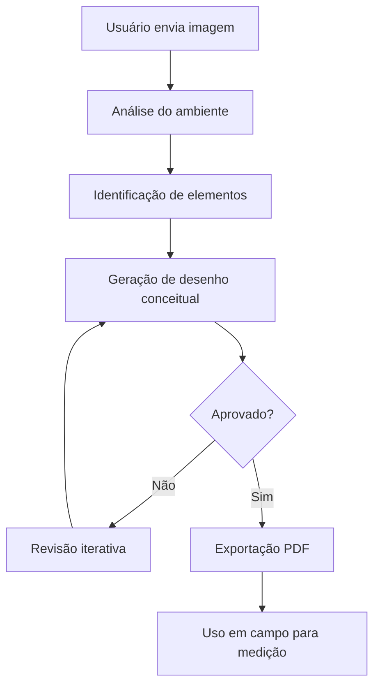

# 🪨 MarmoView - Sistema IA para Marmoraria

> Sistema de upload de imagens e geração de desenhos conceituais para marmoraria.


## ⚠️ Importante: Sem Persistência

- **Não salva projetos**: Quando o servidor é fechado ou reiniciado, todas as informações são perdidas
- **Sem banco de dados**: Dados mantidos apenas em memória durante execução
- **Fluxo único**: Upload → Desenho → PDF → Fim

---

## 🚀 Instalação e Execução

### 1. Instalar Dependências

```bash
pip install -r requirements.txt
```

### 2. Iniciar Backend (Terminal 1)

```bash
python3 app.py
```

O backend estará disponível em: `http://localhost:5000`

### 3. Abrir Frontend (Terminal 2)

Se já houver um servidor rodando na porta 8000:
```bash
# O frontend já estará acessível em http://localhost:8000
```

Caso contrário, inicie um servidor HTTP:
```bash
python3 -m http.server 8000
```

Acesse: `http://localhost:8000`

## 📋 Como Usar

1. **Upload de Imagens**
   - Selecione de 1 a 5 imagens do ambiente (máx 10MB cada)
   - Formatos aceitos: JPG, PNG

2. **Preencha os Campos**
   - Características visuais do ambiente (texto livre)
   - Tipo de ambiente (única escolha)
   - Elementos em pedra (múltipla seleção - Ctrl/Cmd)
   - Formato predominante (única escolha)
   - Recortes aparentes (múltipla seleção - Ctrl/Cmd)

3. **Gerar Desenho**
   - Clique em "🚀 Gerar Desenho Conceitual"
   - Aguarde o processamento
   - PDF será baixado automaticamente

4. **Novo Desenho**
   - Formulário é limpiado automaticamente
   - Ou clique em "🔄 Limpar Formulário"

---

## 📖 Sobre o MarmoView

O **MarmoView** é um motor de inteligência artificial projetado para atuar como especialista em:

- 🏗️ Marmoraria e trabalho com pedras naturais
- 🏛️ Interpretação de ambientes arquitetônicos
- 📸 Leitura visual de imagens técnicas
- ✏️ Geração de desenhos conceituais simplificados

### 🎯 Objetivo Principal

Analisar imagens reais (fotos, PDFs ou scans) de ambientes que possuem elementos em **granito**, **mármore** ou **pedras similares** e gerar **representações gráficas simplificadas** para apoio à medição em campo.

---

## ⚠️ IMPORTANTE: O que o MarmoView NÃO é

### ❌ NÃO é um sistema de fabricação
- Não gera desenhos para execução
- Não cria planos de corte
- Não define dimensões reais

### ✅ É um organizador visual
- Reduz erro humano na interpretação
- Padroniza leitura de ambientes
- Apoia a equipe de medição em campo

> **Princípio Fundamental:** _"Quem mede, manda."_

---

## 🚀 Funcionalidades

### 1. Análise de Imagens
- Identificação de tipo de ambiente (cozinha, banheiro, área gourmet, etc.)
- Detecção de elementos em pedra (bancadas, tampos, ilhas)
- Reconhecimento de formato geométrico (reto, L, U, ilha)
- Identificação de recortes (pia, cooktop, cuba)

### 2. Geração de Desenhos Conceituais
- Desenhos técnicos minimalistas
- Planta 2D vista superior OU perspectiva isométrica
- Sem cotas, medidas ou dimensões
- Estilo limpo e profissional

### 3. Revisão Iterativa
- Ajustes baseados em feedback do usuário
- Correção de formas e orientações
- Inclusão/remoção de elementos

### 4. Exportação em PDF
- Formato padronizado A4
- Cabeçalho com identificação do projeto
- Aviso legal obrigatório
- Área para anotações de campo

---

## 📁 Estrutura do Projeto

```
MarmoView/
├── README.md                          # Este arquivo
├── docs/
│   └── REGRAS_SISTEMA.md             # Regras obrigatórias
├── prompts/
│   ├── 01_analise_arquivo.md         # Prompt de análise
│   ├── 02_geracao_desenho.md         # Prompt de geração
│   ├── 03_revisao_iterativa.md       # Prompt de revisão
│   └── 04_saida_final.md             # Prompt de saída PDF
├── config/
│   └── sistema_config.yaml           # Configurações do sistema
└── examples/
    └── exemplo_projeto.md            # Exemplo de uso
```

---

## 🔧 Como Usar o MarmoView

### Passo 1: Enviar Imagem
Envie uma foto, PDF ou scan do ambiente que contém elementos em pedra.

### Passo 2: Análise Automática
O sistema identifica:
- Tipo de ambiente
- Elementos em pedra
- Formato geométrico
- Recortes aparentes

### Passo 3: Geração do Desenho
O MarmoView gera um desenho conceitual técnico sem dimensões.

### Passo 4: Revisão (se necessário)
Você pode solicitar ajustes na forma, orientação ou elementos.

### Passo 5: Exportação
Receba o PDF padronizado pronto para uso em campo.

---

## 📋 Regras Obrigatórias

### ⛔ É EXPRESSAMENTE PROIBIDO:
- ❌ Criar cotas ou medidas
- ❌ Estimar dimensões
- ❌ Criar detalhamento construtivo
- ❌ Criar desenhos para fabricação
- ❌ Criar planos de corte ou nesting
- ❌ Aplicar escala gráfica ou numérica

### ✅ É OBRIGATÓRIO:
- ✓ Interpretar apenas o que é visível ou claramente inferível
- ✓ Manter o desenho simples, técnico e limpo
- ✓ Trabalhar com formas geométricas básicas
- ✓ Tratar o desenho como um rascunho técnico de apoio

Para detalhes completos, consulte [REGRAS_SISTEMA.md](docs/REGRAS_SISTEMA.md).

---

## 🎨 Exemplos de Desenhos Gerados

### Bancada Reta
```
┌─────────────────────────────┐
│                             │
│  ══════════════════════     │
│  ║                    ║     │
│  ║      [CUBA]        ║     │
│  ║                    ║     │
│  ══════════════════════     │
│                             │
└─────────────────────────────┘
```

### Bancada em L
```
┌─────────────────────────────┐
│                             │
│  ═════════════════          │
│  ║               ║          │
│  ║   [CUBA]      ║          │
│  ║               ║          │
│  ║               ╚═══════   │
│  ║                     ║   │
│  ║    [COOKTOP]        ║   │
│  ║                     ║   │
│  ═══════════════════════   │
│                             │
└─────────────────────────────┘
```

---

## 📊 Fluxo de Trabalho



---

## 🔒 Limitações e Responsabilidades

### O MarmoView NÃO substitui:
- Medição em campo
- Expertise do marmorista
- Verificação dimensional real
- Inspeção técnica presencial

### O MarmoView APOIA:
- Organização visual prévia
- Comunicação entre equipes
- Redução de erro de interpretação
- Padronização de processos

---

## 📞 Suporte e Documentação

### Documentação Completa
- [Regras do Sistema](docs/REGRAS_SISTEMA.md)
- [Prompt de Análise](prompts/01_analise_arquivo.md)
- [Prompt de Geração](prompts/02_geracao_desenho.md)
- [Prompt de Revisão](prompts/03_revisao_iterativa.md)
- [Prompt de Saída](prompts/04_saida_final.md)

---

## 📝 Versão

**Versão Atual:** 1.0.0  
**Data:** Dezembro 2025  
**Status:** Em produção

---

## 🏆 Princípio MarmoView

> _"O MarmoView é um organizador visual e redutor de erro humano.  
> Ele respeita o princípio clássico da marmoraria:  
> **'Quem mede, manda.'**"_

---

<div align="center">

**MarmoView** - Inteligência Artificial para Marmoraria

_Desenvolvido com precisão técnica e respeito ao ofício tradicional_

</div>
